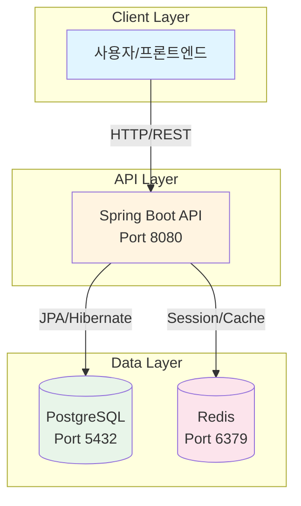
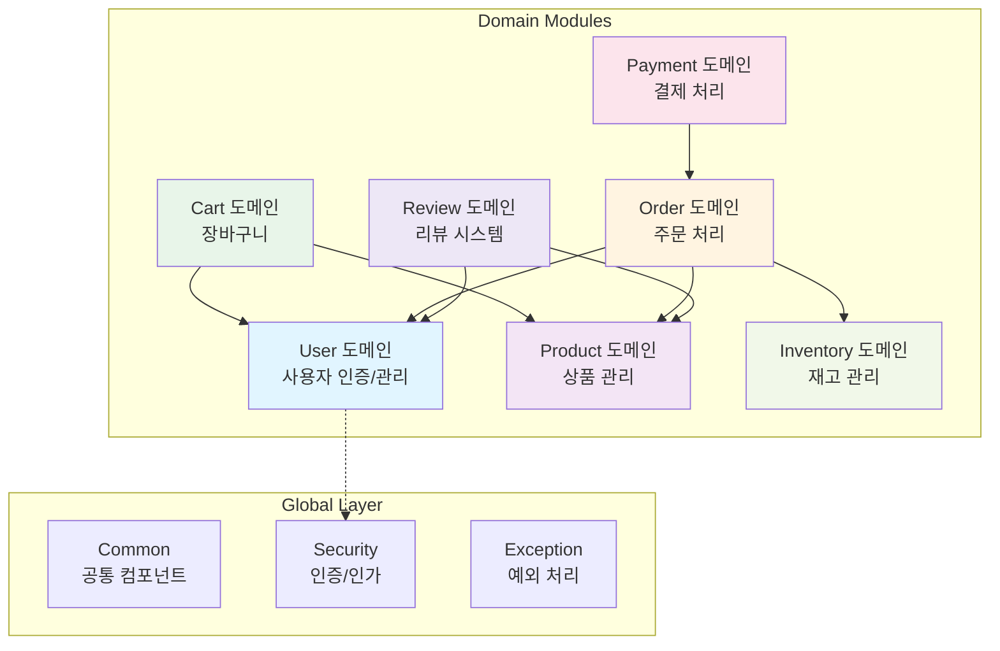

# claude-code-study01

클로드 코드 연습을 위한 레포지토리입니다.

## 🛠 기술 스택

### Backend
- **Java** 17 (LTS)
- **Spring Boot** 3.2.2
- **Spring Security** 6.x
- **Spring Data JPA** 3.x
- **QueryDSL** 5.0.0
- **PostgreSQL** 16.x
- **Redis** 7.x
- **JWT** (jjwt 0.12.3)
- **Gradle** 8.x

### Tools & Libraries
- MapStruct (DTO 매핑)
- SpringDoc OpenAPI (API 문서화)
- Lombok
- Docker & Docker Compose

## 📚 문서

- [CLAUDE.md](./genious-api/CLAUDE.md) - AI 어시스턴트용 프로젝트 상세 컨텍스트
- [전체_요구사항.md](./genious-api/전체_요구사항.md) - 프로젝트 요구사항 명세
- [전체_요구사항_분석.md](./genious-api/전체_요구사항_분석.md) - 요구사항 분석 및 다이어그램
- [전체_프로젝트 구조.md](./genious-api/전체_프로젝트%20구조.md) - 아키텍처 설계 문서

## 📁 클로드 활용 관련 프로젝트 구조 정리
./.claude/agents : 서브에이전트 경로
./.claude/commands : 커스텀 명령어 
./.claude/SKILLS : 커스텀 스킬 
./.claude/SKILLS/requirements-annlysis : 요구사항 분석 커스텀 스킬
./.claude/hooks/: 커스텀 훅 쉘스크립트
./.claude/settings.json : 클로드 설정 및 훅 설정
./CLAUDE.md : 어시스턴트용 프로젝트 컨텍스트

```
claude-code-study01/
├── README.md
└── genious-api/                          # Spring Boot 백엔드 프로젝트
    ├── CLAUDE.md                         # AI 어시스턴트용 프로젝트 컨텍스트
    ├── build.gradle                      # Gradle 빌드 설정
    ├── settings.gradle
    ├── .claude/                          # Claude Code 설정
    │   ├── agents/                       # Sprint별 에이전트 가이드
    │   │   ├── sprint-orchestrator.md
    │   │   ├── sprint1-user-auth.md
    │   │   ├── sprint2-product.md
    │   │   ├── sprint3-inventory.md
    │   │   ├── sprint4-cart-wishlist.md
    │   │   ├── sprint5-order.md
    │   │   ├── sprint6-payment.md
    │   │   ├── sprint7-review.md
    │   │   ├── sprint8-admin.md
    │   │   └── sprint9-testing.md
    │   ├── commands/                     # 커스텀 명령어
    │   │   ├── plan.md
    │   │   └── tdd.md
    │   ├── hooks/                        # 커스텀 훅 쉘 스크립트
    │   │   ├── run-feature-tests.sh      # 테스트 코드 실행 쉘
    │   │   └── update-task-progress.sh   # task 업데이트 쉘
    │   └── SKILLS/                       # 커스텀 스킬
    │   │   └── requirements-analysis/
    │   └──settings.json                  # 훅관련설정
    |   ...
    ├── 사용자관리_요구사항.md
    ├── 사용자관리_PLAN.md
    ├── 사용자관리_TASK.md
    ├── 전체_요구사항.md
    ├── 전체_요구사항_분석.md
    ├── 전체_TASK.md
    └── 전체_프로젝트 구조.md
```

## 📁 프로젝트 구조

```
claude-code-study01/
├── README.md
└── genious-api/                          # Spring Boot 백엔드 프로젝트
    ├── CLAUDE.md                         # AI 어시스턴트용 프로젝트 컨텍스트
    ├── build.gradle                      # Gradle 빌드 설정
    ├── settings.gradle
    ├── .claude/                          # Claude Code 설정
    │   ├── agents/                       # Sprint별 에이전트 가이드
    │   │   ├── sprint-orchestrator.md
    │   │   ├── sprint1-user-auth.md
    │   │   ├── sprint2-product.md
    │   │   ├── sprint3-inventory.md
    │   │   ├── sprint4-cart-wishlist.md
    │   │   ├── sprint5-order.md
    │   │   ├── sprint6-payment.md
    │   │   ├── sprint7-review.md
    │   │   ├── sprint8-admin.md
    │   │   └── sprint9-testing.md
    │   ├── commands/                     # 커스텀 명령어
    │   │   ├── plan.md
    │   │   └── tdd.md
    │   └── SKILLS/                       # 커스텀 스킬
    │   │   └── requirements-analysis/
    │   └──settings.json                  # 훅관련설정
    ├── src/
    │   ├── main/
    │   │   ├── java/com/genious/api/
    │   │   │   ├── GeniousApiApplication.java
    │   │   │   ├── domain/              # 도메인별 패키지 (DDD)
    │   │   │   │   ├── user/           # 사용자 도메인
    │   │   │   │   │   ├── entity/
    │   │   │   │   │   │   └── Role.java
    │   │   │   │   │   ├── repository/
    │   │   │   │   │   ├── service/
    │   │   │   │   │   ├── controller/
    │   │   │   │   │   └── dto/
    │   │   │   │   ├── product/        # 상품 도메인 (예정)
    │   │   │   │   ├── cart/           # 장바구니 도메인 (예정)
    │   │   │   │   ├── order/          # 주문 도메인 (예정)
    │   │   │   │   ├── payment/        # 결제 도메인 (예정)
    │   │   │   │   ├── inventory/      # 재고 도메인 (예정)
    │   │   │   │   └── review/         # 리뷰 도메인 (예정)
    │   │   │   └── global/             # 전역 설정 및 공통 컴포넌트
    │   │   │       ├── common/
    │   │   │       │   ├── ApiResponse.java      # 공통 API 응답
    │   │   │       │   ├── BaseEntity.java       # 공통 엔티티
    │   │   │       │   └── PageResponse.java     # 페이징 응답
    │   │   │       ├── config/         # 설정 클래스 (예정)
    │   │   │       ├── exception/
    │   │   │       │   ├── BusinessException.java
    │   │   │       │   ├── ErrorCode.java
    │   │   │       │   └── GlobalExceptionHandler.java
    │   │   │       ├── security/       # 보안 설정 (예정)
    │   │   │       └── util/           # 유틸리티 (예정)
    │   │   └── resources/
    │   │       └── application.yml     # 환경별 설정 (local/dev/prod)
    │   └── test/                        # 테스트 코드 (예정)
    ├── 사용자관리_요구사항.md
    ├── 사용자관리_PLAN.md
    ├── 사용자관리_TASK.md
    ├── 전체_요구사항.md
    ├── 전체_요구사항_분석.md
    ├── 전체_TASK.md
    └── 전체_프로젝트 구조.md
```

## 🏗 아키텍처 구조

### 시스템 아키텍처



### 애플리케이션 계층 구조

```mermaid
graph LR
    subgraph "Presentation Layer"
        Controller[Controller<br/>@RestController]
    end

    subgraph "Business Layer"
        Service[Service<br/>@Service]
    end

    subgraph "Persistence Layer"
        Repository[Repository<br/>@Repository]
        Entity[Entity<br/>@Entity]
    end

    subgraph "Infrastructure"
        Config[Config<br/>Security/JWT]
        Exception[Exception Handler]
    end

    Controller --> Service
    Service --> Repository
    Repository --> Entity
    Config -.-> Controller
    Exception -.-> Controller

    style Controller fill:#e3f2fd
    style Service fill:#f3e5f5
    style Repository fill:#e8f5e9
    style Entity fill:#fff3e0
```

### 도메인 모듈 구조




