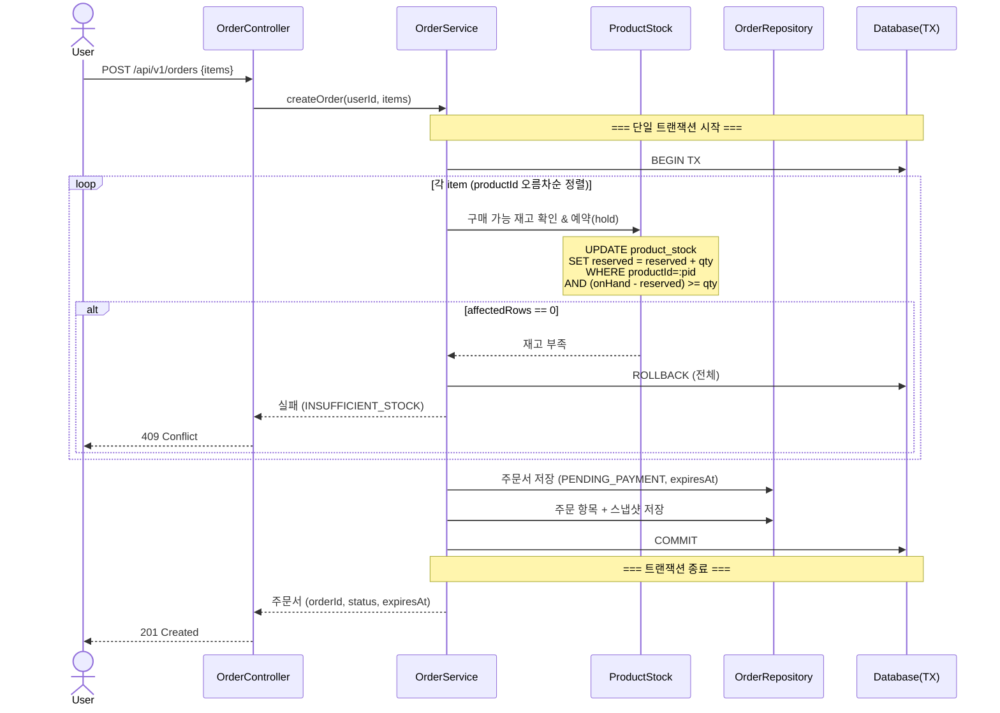
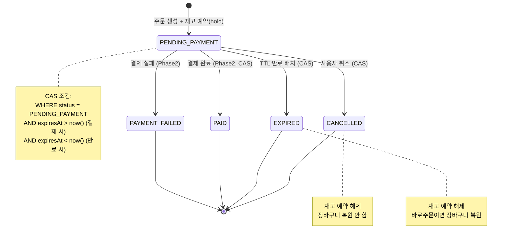
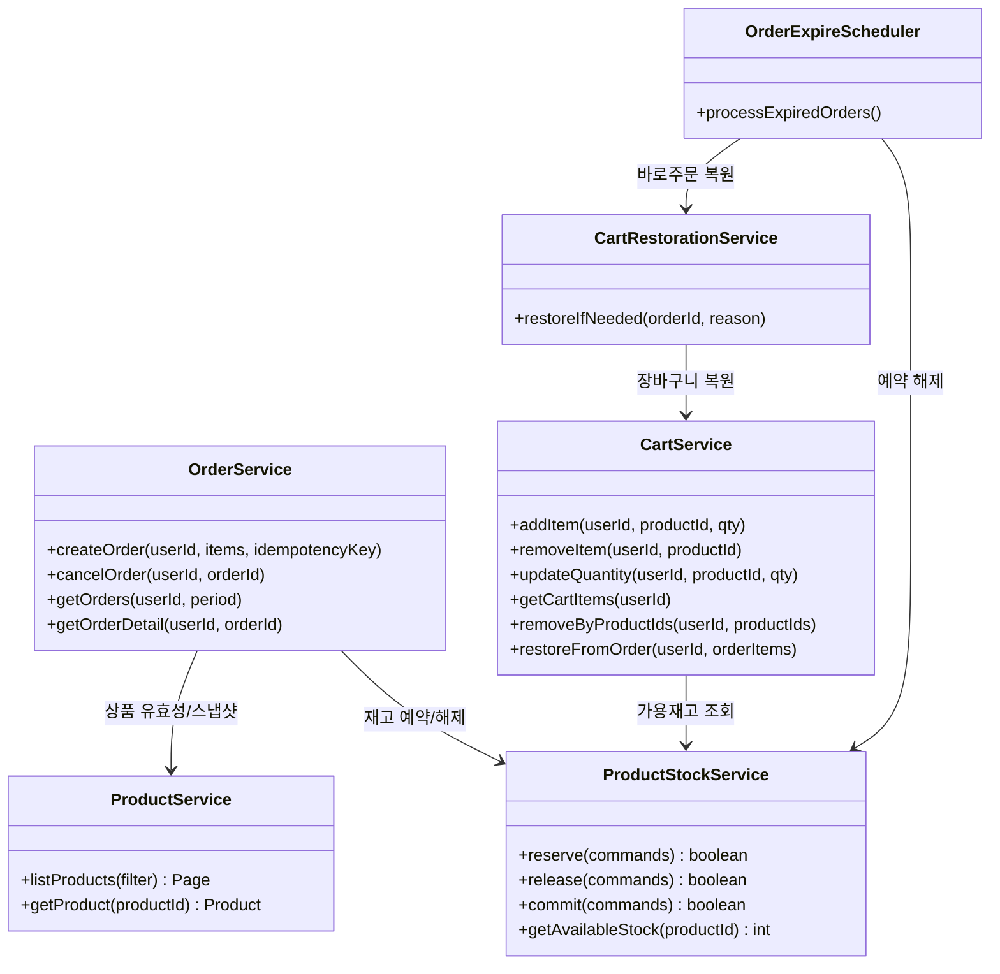

# 이커머스 MVP 요구사항 분석

> 이 문서는 `01-requirements.md`의 요구사항을 문제 중심으로 재해석하고, 애매한 부분을 드러내며, 설계 사고를 정렬하기 위한 분석 결과입니다.

---

## 1. 요구사항을 문제 상황으로 재해석

### 사용자 관점의 문제

| 시나리오 | 표면적 요구사항 | 실제 해결하려는 문제 |
|---|---|---|
| 장바구니 → 주문 | "장바구니에서 선택 주문" | 사용자가 담아둔 상품이 주문 시점에 상태/가격/재고가 달라졌을 때, **기대와 실제의 불일치**를 어떻게 처리할 것인가 |
| 바로 주문 실패 → 장바구니 복원 | "결제 실패 시 장바구니에 자동 복원" | 사용자가 구매 의사를 표현했으나 결제가 실패했을 때, **구매 플로우를 처음부터 다시 시작해야 하는 불편함** 방지 |
| 좋아요 | "좋아요 등록/취소 멱등" | 네트워크 지연이나 중복 클릭 시 **의도치 않은 토글**이 발생하지 않도록 보장 |
| 주문 스냅샷 | "주문 항목에 스냅샷 저장" | 상품이 수정/삭제된 후에도 사용자가 **"내가 뭘 샀는지"를 정확히 확인**할 수 있어야 함 |
| 장바구니 최신 반영 | "장바구니는 스냅샷이 아닌 최신 정보" | 사용자가 장바구니를 열었을 때 **이미 없는 상품을 주문하려는 실수**를 방지 |

### 비즈니스 관점의 문제

| 영역 | 문제 |
|---|---|
| 재고 정합성 | 동시 주문 시 **오버셀(초과 판매)**이 발생하면 안 됨. 예약(hold) → 차감(commit) 2단계로 분리하여 결제 전 재고를 확보하면서도, 결제 미완료 시 재고가 영구 잠기지 않아야 함 |
| 상품 운영 연속성 | 상품을 삭제/수정해도 **기존 주문의 이력이 훼손되지 않아야** 함 (소프트 삭제 + 스냅샷) |
| 브랜드-상품 종속성 | 브랜드 삭제 시 소속 상품도 **cascading soft delete** 해야 하며, 이 영향이 장바구니/주문에 일관되게 반영되어야 함 |
| 운영 가시성 | 관리자는 삭제/수정된 상품을 포함해 **전체 이력을 볼 수 있어야** 함 (감사 추적) |

### 시스템 관점의 문제

| 영역 | 문제 |
|---|---|
| 상태 전이 경쟁 | 주문의 `PENDING_PAYMENT → EXPIRED` 전환과 `PENDING_PAYMENT → PAID` 전환이 동시에 일어날 수 있음. **CAS(Compare-And-Set) 없이는 이중 처리** 위험 |
| 재고 원자성 | 다건 상품 주문에서 일부만 재고 예약 성공하고 나머지가 실패하면 **부분 hold leak** 발생. 단일 트랜잭션 + 정렬된 락 순서가 필수 |
| 만료 배치 안정성 | 스케줄러가 만료 처리하는 동안 해당 주문에 결제 완료가 들어오면 **데이터 불일치** 위험 |
| 장바구니-재고 비정합 허용 | 장바구니는 재고를 예약하지 않으므로, 장바구니에 담은 수량이 주문 시점에 **이미 소진**되었을 수 있음. 이는 의도적 트레이드오프 |

---

## 2. 애매한 요구사항 목록 & 확정 결과

### 결정되지 않았던 사항들 → 합의 결과

| # | 유형 | 미결정 사항 | 확정 결과 |
|---|---|---|---|
| A1 | 정책 | 인증/인가 방식 | **JWT (Stateless)** — Spring Security + JWT 필터 |
| A2 | 정책 | 비밀번호 정책의 구체적 규칙 | 최소 8자, 영문+숫자+특수문자 조합 (구현 시 확정) |
| A3 | 정책 | 재고 예약 TTL 값 | **15분** |
| A4 | 정책 | 회원가입 시 식별자 | **별도 loginId + email** — loginId는 로그인용, email은 연락/복구용 |
| A5 | 경계 | 장바구니 복원 시 재고 초과분 처리 | **수량 그대로 복원 + 조회 시 경고** — available/unavailableReason으로 표시 |
| A6 | 경계 | `items` 내 동일 `productId` 중복 시 처리 | **합산 병합** — [{pid:1, qty:2}, {pid:1, qty:3}] → {pid:1, qty:5} |
| A7 | 경계 | HIDDEN 상태에서 신규 주문 가능 여부 | **HIDDEN은 신규 주문 불가** — 기존 PENDING_PAYMENT 예약만 유효 |
| A8 | 확장 | 상품 수정 이력(Revision) 저장 범위 | **변경 전/후 전체 스냅샷** — before/after JSON 저장, diff 비교 용이 |
| A9 | 확장 | 운영 통계의 실시간성 | **MVP에서는 RDBMS 직접 집계** + 적절한 인덱스 |
| A10 | 정책 | Admin 인증 체계 | **User와 동일 시스템** — UserRole.ADMIN으로 구분 |
| A11 | 경계 | 바로주문 취소 시 장바구니 복원 | **EXPIRED/PAYMENT_FAILED만 복원** — 사용자 직접 취소(CANCELLED)는 복원 안 함 |
| A12 | 정책 | 장바구니 재고 초과 검증 범위 | 구매 가능 재고(AvailableStock) 기준, 다른 사용자 장바구니는 고려하지 않음 (의도적) |

### 확정 정책 요약 (9건)

| # | 항목 | 결정 |
|---|---|---|
| 1 | 인증 | JWT (Stateless) |
| 2 | 회원 식별자 | 별도 loginId + email |
| 3 | 기술 스택 | Java + Spring Boot + PostgreSQL + JPA + MyBatis |
| 4 | 취소 복원 대상 | EXPIRED / PAYMENT_FAILED만 (사용자 직접 취소는 복원 안 함) |
| 5 | 복원 시 재고 초과 | 수량 그대로 복원 + 조회 시 available/unavailableReason 표시 |
| 6 | 복원 시점 | 즉시 (동기, 같은 트랜잭션) |
| 7 | 동일 productId 중복 | 합산 병합 |
| 8 | HIDDEN 상품 주문 | 신규 주문 불가 (ACTIVE만 허용) |
| 9 | Revision 저장 | 변경 전/후 전체 스냅샷 (JSON) |

---

## 3. 개념 모델

### 액터 정의

```
[Guest]     ──── 비인증 사용자. 브랜드/상품 조회, 회원가입만 가능
[User]      ──── 인증된 회원. 좋아요, 장바구니, 주문 가능
[Admin]     ──── 내부 운영자. 카탈로그 관리, 주문 모니터링, 통계 조회
[Scheduler] ──── 시스템 내부 액터. 만료 주문 배치 처리
```

### 핵심 도메인

```
┌─────────────────────────────────────────────────────────┐
│                    Core Domain                          │
│                                                         │
│  [Brand] ◄──owns── [Product] ──has── [ProductStock]     │
│                        │                                │
│              ┌─────────┼──────────┐                     │
│              ▼         ▼          ▼                     │
│          [Like]    [CartItem]  [OrderItem]               │
│           (선호)    (후보목록)   (확정구매)               │
│                        │          │                     │
│                        ▼          ▼                     │
│                     [Cart]     [Order]                   │
│                    (비예약)    (예약/확정)                │
└─────────────────────────────────────────────────────────┘
```

### 보조/외부 시스템

```
[ProductRevision]  ── 상품 변경 이력 (감사 추적)
[OrderCartRestore] ── 바로주문 실패 시 복원 기록 (멱등성 보장)
[Payment]          ── Phase2 결제 시스템 (현재 스텁)
```

### 도메인 간 핵심 관계

- **Product ↔ Brand**: 상품은 반드시 하나의 브랜드에 속함. 브랜드 삭제 시 상품도 cascade soft delete
- **Cart ↔ Product**: 장바구니는 상품의 **참조**만 가짐 (스냅샷 없음). 조회 시점에 Product join
- **Order ↔ Product**: 주문은 상품의 **스냅샷**을 가짐 (시점 고정). 이후 상품 변경에 영향 없음
- **Product ↔ ProductStock**: 재고는 상품과 1:1. `onHand`(총재고), `reserved`(예약분), `available = onHand - reserved`
- **Order ↔ ProductStock**: 주문 생성 시 `reserved += qty`, 취소/만료 시 `reserved -= qty`, 결제 시 `onHand -= qty, reserved -= qty`

---

## 4. 다이어그램

### 4.1 주문 생성 시퀀스 다이어그램

**왜 필요한가**: 주문 생성은 이 시스템에서 가장 복잡한 트랜잭션 흐름입니다. 재고 확인 → 예약 → 스냅샷 저장 → 주문서 생성이 **단일 트랜잭션**으로 묶여야 하는데, 이 경계와 실패 시 롤백 범위를 검증하기 위해 필요합니다.



**읽는 법**:
- 재고 예약 루프가 **productId 오름차순**으로 정렬되어 있는 점을 주목. 이것이 다건 주문 시 데드락을 방지하는 핵심.
- 하나의 상품이라도 재고 부족이면 **이미 예약된 상품도 포함해 전체 롤백**. 부분 성공이 없으므로 hold leak가 발생하지 않음.
- 스냅샷 저장이 트랜잭션 안에 있으므로 주문서와 스냅샷의 정합성이 보장됨.

---

### 4.2 주문 상태 전이 다이어그램

**왜 필요한가**: 결제(Phase2) 포함 시 `PENDING_PAYMENT` → `PAID`와 `PENDING_PAYMENT` → `EXPIRED` 가 경쟁할 수 있습니다. CAS 기반 상태 전이의 안전성을 검증하기 위해 필요합니다.



**읽는 법**:
- 모든 상태 전이가 `PENDING_PAYMENT`에서만 출발. 한번 전이되면 **돌아올 수 없는 단방향**.
- `CANCELLED`와 `EXPIRED`의 차이: 전자는 사용자 의도, 후자는 시스템 자동 처리.
- Phase1에서는 `PAID`, `PAYMENT_FAILED`는 사용하지 않으나, 상태 enum에 미리 정의해두어 Phase2 확장에 대비.

---

### 4.3 ERD (핵심 엔티티)

**왜 필요한가**: 도메인 간 관계의 주인(FK), 소프트 삭제 컬럼, 재고 모델의 물리 구조를 확인하기 위해 필요합니다.

```mermaid
erDiagram
    USER {
        bigint id PK
        varchar login_id UK
        varchar email UK
        varchar password_hash
        varchar name
        varchar role "USER, ADMIN"
        datetime created_at
        datetime updated_at
    }

    BRAND {
        bigint id PK
        varchar name
        varchar description
        varchar status "ACTIVE, HIDDEN, DELETED"
        datetime deleted_at "nullable, soft delete"
        datetime created_at
        datetime updated_at
    }

    PRODUCT {
        bigint id PK
        bigint brand_id FK
        varchar name
        text description
        decimal price
        varchar image_url "nullable"
        varchar status "ACTIVE, HIDDEN, DELETED"
        datetime deleted_at "nullable"
        datetime created_at
        datetime updated_at
    }

    PRODUCT_STOCK {
        bigint product_id PK_FK
        int on_hand "총 재고"
        int reserved "예약 재고"
    }

    PRODUCT_REVISION {
        bigint id PK
        bigint product_id FK
        varchar change_type "CREATED, UPDATED, DELETED"
        jsonb before_snapshot "nullable"
        jsonb after_snapshot
        varchar changed_by "admin userId"
        varchar change_reason "nullable"
        datetime changed_at
    }

    LIKES {
        bigint id PK
        bigint user_id FK
        bigint product_id FK
        datetime created_at
    }

    CART_ITEM {
        bigint id PK
        bigint user_id FK
        bigint product_id FK
        int quantity
        datetime created_at
        datetime updated_at
    }

    ORDERS {
        bigint id PK
        bigint user_id FK
        varchar status "PENDING_PAYMENT, CANCELLED, EXPIRED, PAID, PAYMENT_FAILED"
        varchar order_source "DIRECT, CART"
        varchar idempotency_key "nullable, UK"
        decimal total_amount
        datetime expires_at
        datetime created_at
        datetime updated_at
    }

    ORDER_ITEM {
        bigint id PK
        bigint order_id FK
        bigint product_id FK
        int quantity
        decimal snapshot_unit_price
        varchar snapshot_product_name
        bigint snapshot_brand_id
        varchar snapshot_brand_name
        varchar snapshot_image_url "nullable"
    }

    ORDER_CART_RESTORE {
        bigint id PK
        bigint order_id FK_UK "멱등성 보장"
        varchar reason "EXPIRED, PAYMENT_FAILED"
        datetime restored_at
    }

    USER ||--o{ LIKES : "has"
    USER ||--o{ CART_ITEM : "has"
    USER ||--o{ ORDERS : "places"
    BRAND ||--o{ PRODUCT : "owns"
    PRODUCT ||--|| PRODUCT_STOCK : "has"
    PRODUCT ||--o{ PRODUCT_REVISION : "tracked by"
    PRODUCT ||--o{ LIKES : "receives"
    PRODUCT ||--o{ CART_ITEM : "referenced in"
    PRODUCT ||--o{ ORDER_ITEM : "snapshot in"
    ORDERS ||--o{ ORDER_ITEM : "contains"
    ORDERS ||--o| ORDER_CART_RESTORE : "may trigger"
```

**읽는 법**:
- **PRODUCT ↔ PRODUCT_STOCK가 1:1**: 재고를 별도 테이블로 분리한 이유는 재고 UPDATE의 락 범위를 상품 메타데이터 변경과 분리하기 위함.
- **LIKES의 유니크 제약**: `(user_id, product_id)` 복합 유니크. 멱등성의 물리적 보장.
- **CART_ITEM에 스냅샷 컬럼이 없음**: 장바구니는 항상 Product 테이블을 join하여 최신 정보를 반영.
- **ORDER_ITEM에 스냅샷 컬럼이 있음**: 주문은 시점 고정. `snapshot_*` 컬럼이 주문 시점의 상품 정보를 영구 보존.
- **ORDER_CART_RESTORE**: `order_id`에 UNIQUE 제약으로 멱등 복원 보장.
- **ORDERS.order_source**: `DIRECT`(바로주문)와 `CART`(장바구니 주문)를 구분.

---

### 4.4 클래스 다이어그램 (도메인 레이어 책임 분리)

**왜 필요한가**: 도메인 간 의존 방향과 서비스 레이어의 책임 경계를 확인하기 위해 필요합니다.



---

## 5. 설계의 잠재 리스크

### 리스크 1: OrderService 트랜잭션 비대화
주문 생성 시 `재고 예약 + 주문서 저장 + 스냅샷 저장`이 하나의 트랜잭션. 상품이 많아지면 트랜잭션 시간이 길어지고 락 경합이 심해질 수 있음.
- **MVP 대응**: 단일 트랜잭션 유지 + 상품 수 제한(예: 최대 20개)

### 리스크 2: 장바구니 조회 시 N+1 문제
장바구니 조회는 각 항목마다 Product + ProductStock을 join 필요.
- **MVP 대응**: MyBatis 전용 조회 쿼리로 한 번에 JOIN

### 리스크 3: 만료 배치와 결제의 경쟁 조건
배치가 만료 처리하는 동안 결제 완료가 들어오면 데이터 불일치 위험.
- **MVP 대응**: 상태 전환과 재고 해제를 **동일 트랜잭션**에서 CAS로 처리

### 리스크 4: 브랜드 삭제 시 cascade 범위
브랜드 삭제 → 소속 상품 중 `PENDING_PAYMENT` 주문이 있으면?
- **MVP 대응**: 브랜드 삭제 시 소속 상품에 PENDING_PAYMENT 예약이 있으면 브랜드 삭제 거부

### 리스크 5: 통계 쿼리의 성능
- **MVP 대응**: 운영 DB에서 직접 집계 + 적절한 인덱스
