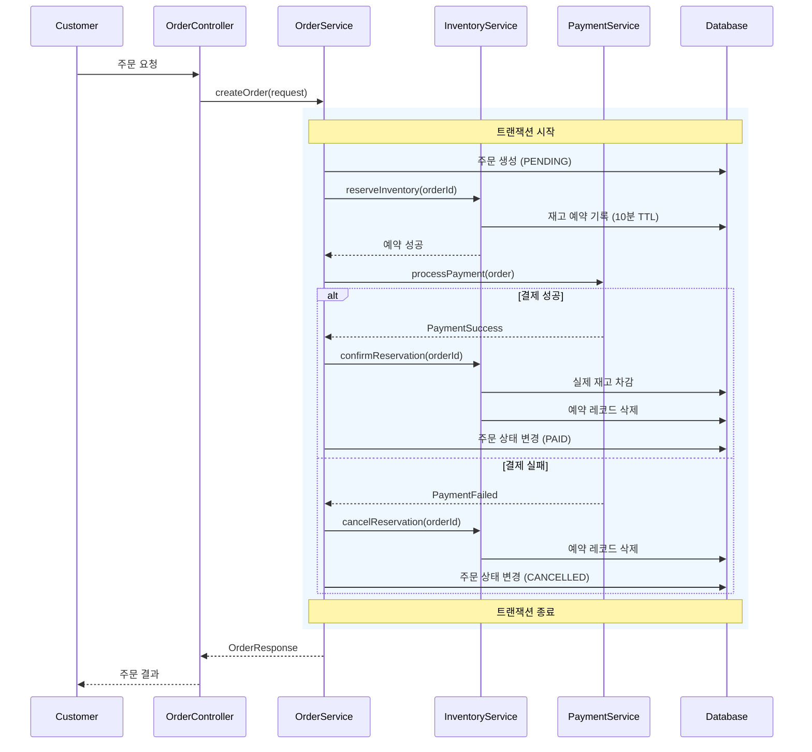
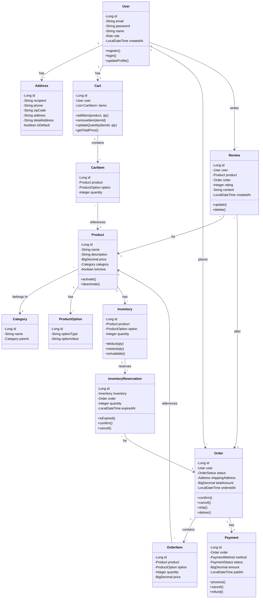
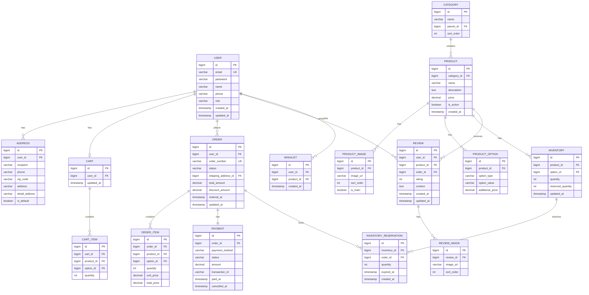

# 지니어스 E-commerce 요구사항 분석

**작성일**: 2026-02-09  
**분석 방법론**: requirements-analysis SKILL 적용  
**원본 문서**: requirements.md

---

## 📋 목차
1. [문제 상황 관점에서의 요구사항 재해석](#1️⃣-문제-상황-관점에서의-요구사항-재해석)
2. [애매한 요구사항 - 결정이 필요한 부분들](#2️⃣-애매한-요구사항---결정이-필요한-부분들)
3. [명확화를 위한 질문](#3️⃣-명확화를-위한-질문)
4. [확정된 설계 방향](#4️⃣-확정된-설계-방향)
5. [개념 모델 정의](#5️⃣-개념-모델-정의)
6. [다이어그램](#6️⃣-다이어그램)

---

## 1️⃣ 문제 상황 관점에서의 요구사항 재해석

> **핵심 원칙**: "무엇을 만들까?"가 아니라 "지금 어떤 문제가 있고, 그걸 왜 해결하려는가?"로 재해석

### 사용자 관점

| 요구사항 | 해결하려는 문제 |
|---------|----------------|
| 회원가입/로그인 | 사용자가 자신의 구매 이력, 배송지 등을 안전하게 관리할 수 있어야 함 |
| 장바구니/위시리스트 | 구매 결정 전 상품을 임시 보관하고 비교할 수 있어야 함 |
| 주문/결제 | 원하는 상품을 신뢰할 수 있는 방식으로 구매할 수 있어야 함 |
| 리뷰/평점 | 다른 구매자의 경험을 참고해 구매 결정을 내릴 수 있어야 함 |

### 비즈니스 관점

| 요구사항 | 해결하려는 문제 |
|---------|----------------|
| 상품 관리 | 판매할 상품을 효율적으로 등록/관리하고 고객에게 노출시켜야 함 |
| 주문 상태 관리 | 주문-결제-배송-완료까지의 흐름을 추적하고 관리해야 함 |
| 재고 관리 | 판매 가능 수량과 실제 재고의 불일치를 방지해야 함 |
| 통계/분석 | 매출, 인기 상품 등 비즈니스 인사이트를 얻어야 함 |

### 시스템 관점

| 요구사항 | 해결하려는 문제 |
|---------|----------------|
| JWT 인증 | 무상태(Stateless) 환경에서 사용자 인증을 유지해야 함 |
| 실시간 재고 | 동시 주문 시 재고 정합성을 유지해야 함 |
| 주문-결제-재고 연동 | 트랜잭션 실패 시 데이터 일관성을 보장해야 함 |

---

## 2️⃣ 애매한 요구사항 - 결정이 필요한 부분들

> **핵심 원칙**: 추측하거나 알아서 결정하지 않고, 결정되지 않은 부분을 명시적으로 나열

### 🔴 정책 질문 (기준, 조건, 예외 처리)

#### 1. 주문 취소/환불 정책
- 취소 가능 시점은 언제까지인가? (주문 접수 후? 배송 시작 전?)
- 부분 취소가 가능한가?
- 환불 금액 산정 기준은?

#### 2. 재고 차감 시점
- 장바구니 담을 때? 주문 생성 시? 결제 완료 시?
- 재고 부족 시 대기열/알림 기능이 필요한가?

#### 3. 리뷰 정책
- 구매 확정 후만 리뷰 가능한가? 배송 완료 후 바로 가능한가?
- 리뷰 수정 기한이 있는가?
- 부적절한 리뷰 신고/삭제 정책은?

#### 4. 주문 상태 전이 규칙
- "배송 완료 → 구매 확정" 자동 전환 기간은?
- 상태별 역전이(롤백) 가능 여부는?

### 🟡 경계 질문 (책임 분리, 도메인 경계)

#### 1. 사용자와 주문의 관계
- 비회원 구매(Guest Checkout)를 지원하는가?

#### 2. 결제와 주문의 경계
- 결제 실패 시 주문은 어떤 상태로 남는가?
- 결제 시스템 장애 시 주문 생성을 막을 것인가, 임시 저장할 것인가?

#### 3. 재고와 상품의 경계
- 옵션별(색상, 사이즈) 재고 관리인가, 상품 단위 재고인가?
- 예약 판매(선주문) 개념이 있는가?

### 🟢 확장 질문 (변경 가능성)

#### 1. 다중 판매자 지원 여부
- 현재는 단일 판매자인가? 추후 마켓플레이스 확장 가능성은?

#### 2. 해외 배송/다국어 지원
- 국내 전용인가? 확장 계획이 있는가?

#### 3. 쿠폰/포인트 시스템
- "추가 검토 사항"에 있는데, Phase 1에 포함되는가?

---

## 3️⃣ 명확화를 위한 질문

> **핵심 원칙**: 질문은 우선순위를 가지며, 선택지 + 영향도를 함께 제시

### Q1. MVP 범위 확정 (가장 중요)
**Phase 1에 반드시 포함되어야 할 핵심 기능은 무엇인가요?**

| 선택지 | 설명 | 영향도 |
|--------|------|--------|
| A. 최소 MVP | 회원가입, 상품조회, 장바구니, 주문(Mock결제) | 개발 2-3주, 빠른 검증 가능 |
| B. 핵심 MVP | A + 실제 결제연동, 리뷰, 관리자 대시보드 | 개발 4-6주, 실 서비스 가능 수준 |
| C. 전체 기능 | B + 쿠폰/포인트, 실시간 알림, 추천 시스템 | 개발 8-12주, 경쟁력 있는 서비스 |

**✅ 결정: B. 핵심 MVP**

---

### Q2. 결제 시스템 구현 방식
**결제 연동을 어떻게 처리할 예정인가요?**

| 선택지 | 설명 | 영향도 |
|--------|------|--------|
| A. Mock 결제 | 결제 성공/실패만 시뮬레이션 | 구현 단순, 실제 거래 불가 |
| B. 토스페이먼츠 연동 | 실제 PG사 연동 | 실 결제 가능, 정산/수수료 고려 필요 |
| C. 결제 제외 | 주문까지만 구현, 결제는 나중에 | 핵심 로직 먼저 완성, 통합 테스트 어려움 |

**✅ 결정: A. Mock 결제 (Phase 1), Phase 2에서 실제 연동**

---

### Q3. 재고 차감 시점
**재고는 언제 차감되어야 하나요?**

| 선택지 | 설명 | 영향도 |
|--------|------|--------|
| A. 주문 생성 시 | 결제 전 재고 확보 | 미결제 주문으로 재고 묶임 위험 |
| B. 결제 완료 시 | 결제 확인 후 차감 | 동시 주문 시 재고 부족 가능 |
| C. 예약 + 확정 방식 | 주문 시 임시예약, 결제 시 확정 | 구현 복잡, 가장 안전 |

**✅ 결정: C. 예약 + 확정 방식 (소프트 예약 10분 TTL)**

---

### Q4. 비회원 구매 지원 여부
**비회원도 구매 가능해야 하나요?**

| 선택지 | 설명 | 영향도 |
|--------|------|--------|
| A. 회원 전용 | 로그인 필수 | 구현 단순, 고객 데이터 확보 용이 |
| B. 비회원 허용 | Guest Checkout 지원 | 전환율 높음, 주문/배송 추적 복잡 |

**✅ 결정: A. 회원 전용 (Phase 1)**

---

## 4️⃣ 확정된 설계 방향

### ✅ 재고 차감 시점
**결정**: **결제 완료 시 차감** + 주문 생성 시 "소프트 예약" (10분 타임아웃)

**근거**:
- 실제 판매 시점에 차감하여 재고 정확도 향상
- 결제 실패 시 별도 복구 로직 불필요
- 주문 생성 시 소프트 예약으로 동시 주문 경합 완화

**구현 방안**:
1. 주문 생성 시: `InventoryReservation` 엔티티에 임시 예약 기록 (10분 TTL)
2. 결제 완료 시: 실제 재고 차감 + 예약 레코드 삭제
3. 결제 실패/타임아웃 시: 예약 레코드 자동 만료

---

### ✅ 주문-결제 책임 분리
**결정**: **Service 계층 순차 호출** (MVP), 향후 이벤트 기반 전환

**근거**:
- MVP에서는 구현 복잡도를 낮추고 빠른 출시 우선
- @Transactional로 트랜잭션 관리 단순화
- Phase 2에서 Saga 패턴으로 전환 가능한 구조 유지

---

### ✅ 장바구니 저장
**결정**: **하이브리드** 방식 (비로그인: localStorage, 로그인: DB 동기화)

**근거**:
- 비로그인 사용자도 장바구니 사용 가능 (전환율 향상)
- 로그인 시 디바이스 간 동기화 제공
- 서버 부하 최소화

---

## 5️⃣ 개념 모델 정의

### 액터 (사용자, 외부 시스템)

| 액터 | 설명 | 주요 활동 |
|------|------|----------|
| **Customer (일반 사용자)** | 상품을 구매하는 사용자 | 회원가입, 상품조회, 장바구니, 주문, 결제, 리뷰 |
| **Admin (관리자)** | 시스템을 관리하는 사용자 | 상품관리, 주문관리, 회원관리, 통계조회 |
| **PG (결제 시스템)** | 외부 결제 처리 시스템 | 결제 처리, 결제 취소, 환불 |

### 핵심 도메인

| 도메인 | 책임 | 핵심 엔티티 |
|--------|------|------------|
| **User** | 사용자 인증 및 정보 관리 | User, Address, Role |
| **Product** | 상품 정보 및 카테고리 관리 | Product, Category, ProductImage, ProductOption |
| **Inventory** | 재고 수량 관리 | Inventory, InventoryReservation |
| **Cart** | 장바구니 관리 | Cart, CartItem |
| **Wishlist** | 위시리스트 관리 | Wishlist |
| **Order** | 주문 생성 및 상태 관리 | Order, OrderItem, OrderStatus |
| **Payment** | 결제 처리 | Payment, PaymentMethod, PaymentStatus |
| **Review** | 상품 리뷰 관리 | Review, ReviewImage |

### 보조/외부 시스템

| 시스템 | 역할 |
|--------|------|
| **파일 저장소** | 상품 이미지, 리뷰 이미지 저장 |
| **Redis 캐시** | 세션 관리, 장바구니 캐싱 |
| **이메일 서비스** | 회원가입 인증, 주문 알림 |

---

## 6️⃣ 다이어그램

### 📊 시퀀스 다이어그램: 주문-결제 플로우

> **왜 이 다이어그램이 필요한가?**
> - 주문-재고예약-결제-재고확정 간의 호출 순서와 트랜잭션 경계를 명확히 하기 위함
> - 결제 실패 시 보상 처리 흐름을 검증하기 위함

**📌 핵심 포인트**:
1. 재고 예약 → 결제 → 재고 확정 순서로 진행
2. 전체 플로우가 하나의 트랜잭션으로 관리됨
3. 결제 실패 시 예약 취소로 보상 처리

---

### 📊 클래스 다이어그램: 핵심 도메인 모델

> **왜 이 다이어그램이 필요한가?**
> - 도메인 간 책임과 의존 방향을 명확히 하기 위함
> - 응집도와 결합도를 검증하기 위함

**📌 핵심 포인트**:
1. User가 중심이 되어 Cart, Order, Review를 소유
2. Product-Inventory-InventoryReservation으로 재고 관리 분리
3. Order와 Payment는 1:1 관계로 단순화 (Phase 1)

---

### 📊 ERD (Entity Relationship Diagram)

> **왜 이 다이어그램이 필요한가?**
> - 영속성 계층의 테이블 구조와 관계를 정의하기 위함
> - FK 관계와 정규화 수준을 검증하기 위함

**📌 핵심 포인트**:
1. `USER` - `ORDER` - `PAYMENT` 흐름이 핵심 트랜잭션
2. `INVENTORY_RESERVATION`으로 재고 예약 관리 (소프트 예약)
3. 옵션별 재고 관리를 위해 `INVENTORY`가 `PRODUCT_OPTION` 참조

---

## 🚨 설계 잠재 리스크

### 리스크 1: 트랜잭션 비대화
**문제**: 주문-결제-재고 전체를 하나의 트랜잭션으로 관리하면 락 유지 시간 증가
**해결 선택지**:
- A. 현행 유지 (MVP): 구현 단순, 동시성 이슈 발생 시 대응
- B. Phase 2에서 Saga 패턴 도입: 분산 트랜잭션으로 전환

### 리스크 2: 동시 주문 시 재고 경합
**문제**: 인기 상품 마지막 재고를 여러 사용자가 동시 주문
**해결 선택지**:
- A. 비관적 락 사용 (Phase 1 권장)
- B. Redis 분산 락 (Phase 2 확장)

### 리스크 3: 결제 시스템 장애 시 주문 상태 불명확
**문제**: PG 응답 지연/장애 시 주문 상태가 불분명해질 수 있음
**해결 선택지**:
- A. Webhook 기반 비동기 처리
- B. 주기적인 결제 상태 조회 스케줄러

---

**작성자**: Cline AI Assistant (requirements-analysis SKILL 적용)  
**최종 수정일**: 2026-02-09
